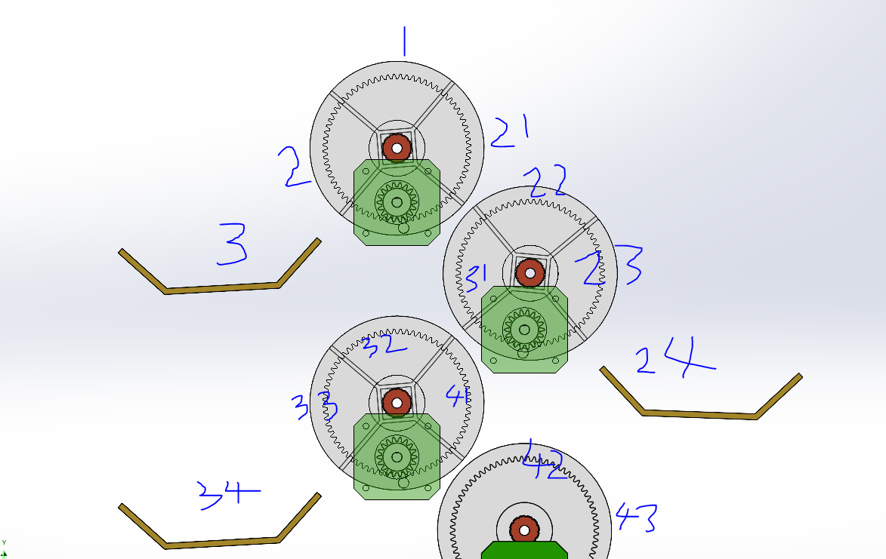

# sorter_mini_controller

## 项目简介

本项目是一个用于控制机械翻转机构的控制器。该机构的物理排布类似一个“分叉树”结构，旨在通过转轮和电机的精确控制，将输入的物料（例如芦笋）分流到指定的终点目的地。

## 机械结构说明

机械结构的整体设计可参考下图：

系统核心包含一个由电机驱动的转轮机构，通过控制旋转方向和时序（节拍）来实现分拣路径的切换。

### 分拣路径与逻辑

1. **物料入口**：
   物料首先由**1号位置**进入系统。
   
2. **第一层分叉（转轮1）**：
   - **左转（逆时针）**：位于1号空间的物体会被转至**2号位置**，随后自然滑落至**3号位置**。此路径至此结束，**3号为终点之一**。
   - **另一方向路径**：物体进入**21号位置**，并随后自然滑落至**22号位置**。

3. **第二层分叉（转轮2 / 22号位）**：
   当物体到达22号位置时，系统面临两个选择：
   - **向右转**：物料转至**23号位置**，随后自然滑落至**24号位置**。此路径结束，**24号为终点之一**。
   - **向左转（向内侧/总线侧）**：物料进入**31号位置**，随后自然滑落至**32号位置**。

4. **后续扩展路径（32号位及以下）**：
   物体到达32号位置后，可继续进行多路分拣：
   - 可能继续转动并滑落至**33、34号位置**，**34号亦为终点之一**。
   - 或者是**向右转**进入**41号位置**，进而流向**42、43号位置**等。

## 工作原理总结

系统分拣逻辑通过为每颗进入1号位置的芦笋设定“目标目的地”（如3号、24号或34号等）来实现。通过控制器协调每一次的“节拍”时序并精准驱动电机使转轮旋转，芦笋将沿着预定的分支路径被精准投放至最终的目的地位置。

## 硬件控制器与资源配置

### 控制器选型
- **主板型号**：**Makerbase MKS BASE V1.6**（基于3D打印机的通用控制器）。
- **核心CPU**：ATmega2560。
- **接口通讯**：通过USB口进行固件烧录与上位机通讯。

### 资源使用与分配
该主板标配5路步进电机驱动接口与6组限位传感器接口，在本项目的第一阶段实验测试中，实际规划使用的资源如下：

- **步进电机**：使用其中的 **X轴、Y轴、Z轴** 3个步进电机驱动接口（共支持5个）。
- **限位传感器 (Home Sensor)**：使用其中的 **X+、Y+、Z+** 3个限位信号接口（共支持6个）。

*注：引脚定义的具体配置将基于 MKS BASE V1.6 的物理排布设定。*

## 软件开发环境规划

- **开发工具**：本项目采用 **PlatformIO** 统一管理开发编译环境。
- **初步计划**：
  1. 在配置文件中正确指定 CPU 型号（Mega 2560）。
  2. 编写并下发简单的 "Hello World" 或串口打印程序，以初步测试板载通讯环境连通性。
  3. 确认硬件可用后开始主体分拣逻辑的编码工作。

## 软件架构与开发思路

### 自主开发策略
- **核心决定**：本项目**不使用**传统的3D打印机固件（如 Marlin）框架。
- **指令集说明**：程序中**不涉及**任何 G-Code 或 M-Code 的解析和执行。
- **定制固件 (Custom Firmware)**：我们将“从零开始”编写一套专门针对此分拣逻辑的底层驱动固件。
- **设计初衷**：通过高度解耦的自写固件，确保极致轻量化与移植便利性，方便未来根据需要平滑过渡到其他非 Mega2560 硬件平台。

## 后续具体待办

1. **[✔] 明确Pin定义**：
   - 获取 MKS BASE V1.6 对应的 `STEP`、`DIR` 引脚映射表（例如 X, Y, Z 轴的硬件关联 IO 口）。
2. **[✔] 环境搭建**：
   - 在本地构建完整的 PlatformIO 项目架构，并跑通首份测试固件。

## 标准操作方法与流程

本设备的基本人机交互操作流程如下：

1. **放置物料**：
   - 操作员将待分拣的物体（例如一根芦笋）放置到机械结构的**总入口位置（1号入口）**。

2. **指令下发**：
   - 按下对应的物理目标选择按钮。控制面板配置了 4 个按钮，分别代表分叉树拓扑中的 4 个最终目标存储格（对应逻辑空间 1, 2, 3, 4，物理坐标分别为 3, 24, 34, 43 号位）。
   - 系统接收到按键触发信号后，分支翻转机构（由3个步进电机协同）自动规划并驱动转轮，将入口物料平稳输送运至特定的终端仓位。
